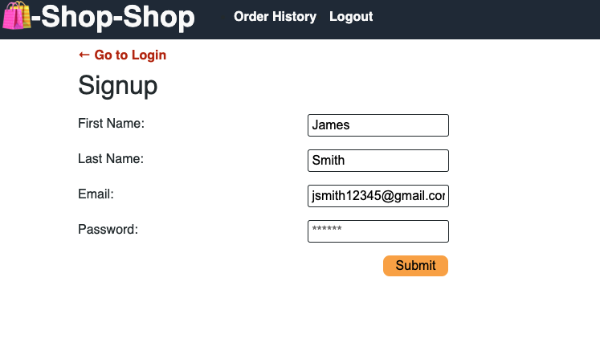
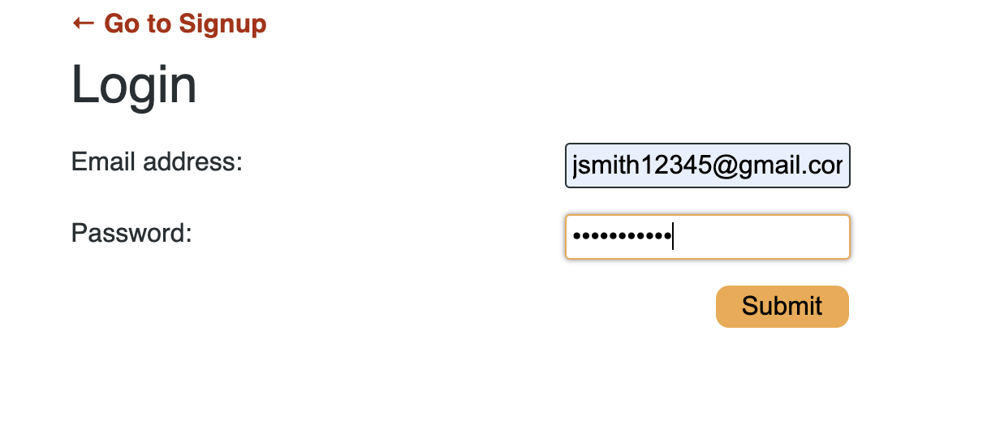
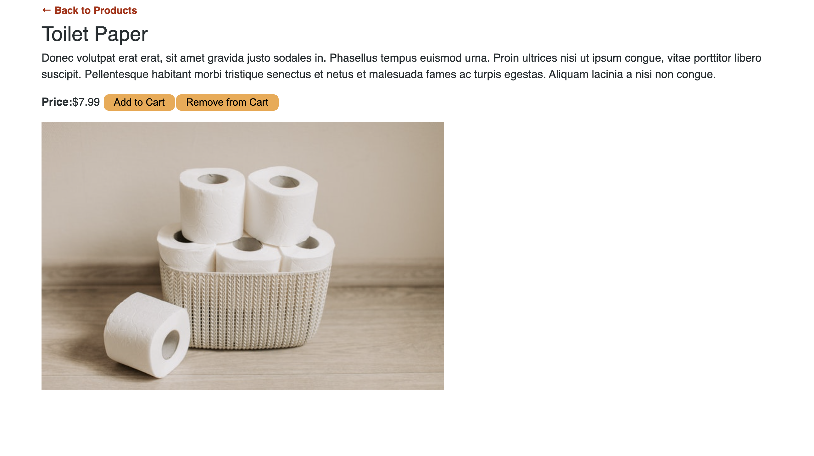
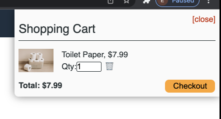
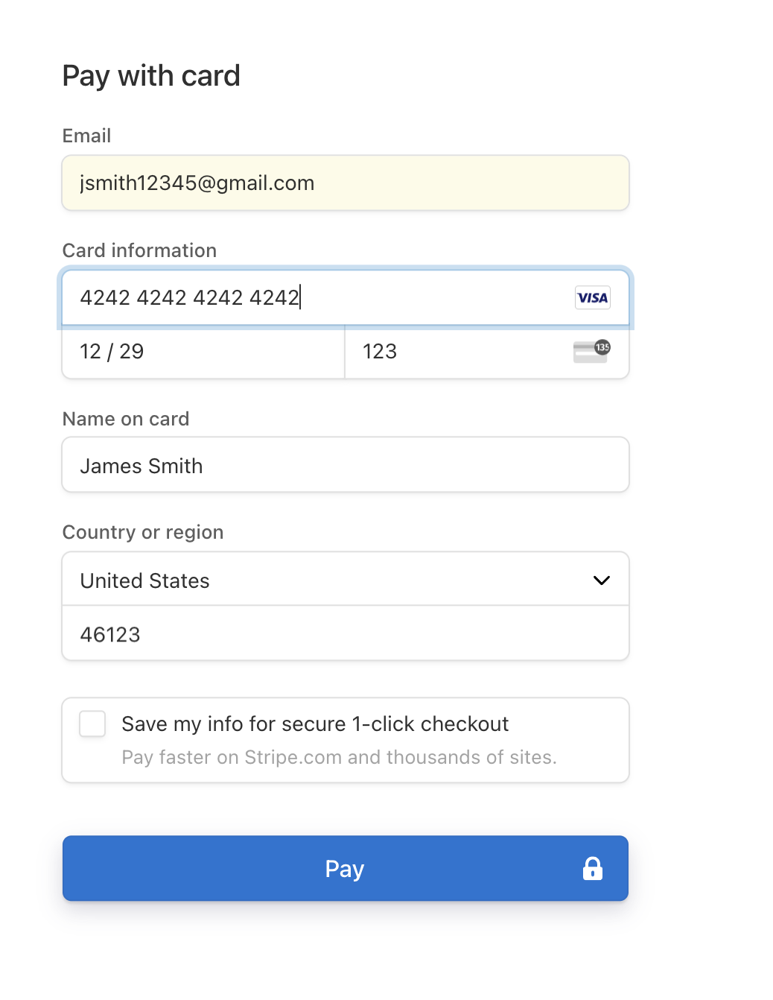
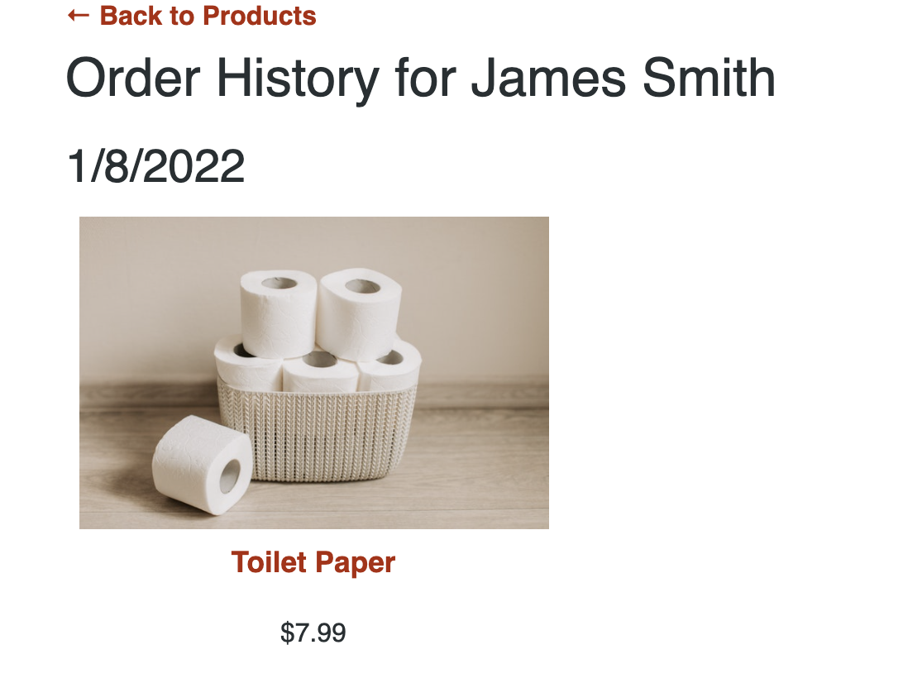

# Shop-Shop using React with Redux
Shop-Shop is an E-commerce application.  This application is equip with a Sign-up and Login page.
  
  
  
As an E-commerce application, the user will have access to a variety items.  Each item have it's own category.  The user can look at all the items or each individual category.  There are 5 categories (Food, Household Supplies, Electronics, Books and Toys).
  

  
When the user click on an item, a description of the item will pop up.
  

  
To purchase an item, the user will have to click "Add to Cart" button.  After clicking on the button, the item will transfer to the cart logo.  
  

  
From the cart logo, the user can increase the quantity or remove the item.  To increase or decrease the quantity, the user will have to click on number inside the qty box and use the up or down arrow.  To remove the item from the cart, the user can click on the trash can.  After the user is done shopping, the user will click on the "Checkout" button.  This will direct the user the checkout page to enter the user's credit card information.
  

  
After completing the transaction, the user can continue to shop or log out.  When the user returns to the E-commerce application, the user can view an order history of past purchase(s).
  

  

## License
The MIT License

## Description: 
Started this project using React's Context API to manage global state.  This MERN application was challenging just setting it up with React's Context API.  After successfully setting up this application, I went through and refactor the project to use Redux.  

### Contents
1.  [Installation](#installation)
2.  [Usage](#usage)
3.  [Contributing](#contributing)
4.  [Tests](#tests)

## Installation:  
To run this project you will need to install npm install, apollo/client, stripe, graphql, react, react-redux, react-dom, react-router-dom, react-scripts, redux and jwt-decode.

## Usage:
The project uses React, React-Redux and Graphql

## Contributing:
none

## Tests:
To run this project, type "npm run develop" in the root folder (shop-shop) at the command prompt.
To run just the server side, type "npm start" in the root folder at the command prompt. (quotation marks are not required)

## Questions:
Github profile:[TCYang1006](https://github.com/TCYang1006)
If there are any additional questions about this project, please contact me at [tcknyaj@gmail.com](tcknyaj@gmail.com)